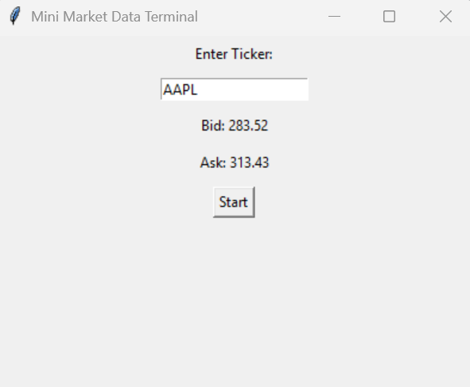

\# Mini Market Data Terminal

This is a Python application that connects to Alpaca's paper trading API to retrieve historical stock data, stream real-time bid/ask quotes, and display everything in a desktop UI. 

\## Features

\- Authenticates securely to Alpaca's paper trading API using environment variables

\- Retrieves 30+ days of historical 1-minute OHLCV bars for any stock symbol

\- Displays historical data as a price + volume chart using matplotlib

\- Streams real-time bid/ask quotes via Alpaca's WebSocket data stream

\- Simple Tkinter UI to enter a ticker and view live bid/ask prices

\## Architecture

\- `data\_connector.py` — handles Alpaca authentication, historical data retrieval, and latest quote lookups

\- `streamer.py` — manages the real-time WebSocket quote stream

\- `chart.py` — generates historical price/volume charts using matplotlib

\- `app.py` — Tkinter UI that ties everything together; runs the live stream on a background thread so the interface stays responsive

## Screenshot

\## Setup Instructions

1\. Clone this repository

2\. Create a virtual environment: `python -m venv venv`

3\. Activate it: `venv\\Scripts\\activate` (Windows)

4\. Install dependencies: `pip install -r requirements.txt`

5\. Create a `.env` file in the project root with your Alpaca paper trading API keys:

ALPACA\_API\_KEY=PKKW56HJVNMBSDLBDGAIVHMS2I

ALPACA\_SECRET\_KEY=GNakZ4LWfgHApmcVsTdzPKwVaw3rWnjcuH8Kh5UxoVR7

6\. Run the app: `python app.py`

\## Usage

\- Launch the app with `python app.py`

\- Type a stock ticker (e.g. AAPL) into the input box

\- Click "Start" to view the latest bid/ask quote and begin streaming live updates

\- For historical charts, run `python -c "from chart import plot\_historical\_bars; plot\_historical\_bars('AAPL', days=30)"`

\- This project uses Alpaca's paper trading environment only — no real money is used

\- Real-time quotes only update during active US market hours (9:30 AM–4:00 PM ET, weekdays)

## AI Assistance Disclosure
This project was completed with the assistance of Claude as an AI pair-programming tool, which was okayed by Tobias. AI was used for:
- Guidance on project structure and module organization
- Debugging environment and setup issues (Python PATH, PowerShell, Git)
- Understanding Alpaca API concepts (historical data requests, WebSocket streaming)
- Understanding Tkinter threading patterns for real-time UI updates

All code was reviewed and understood before use. The overall design, decisions, and implementation are my own.
\## Notes

